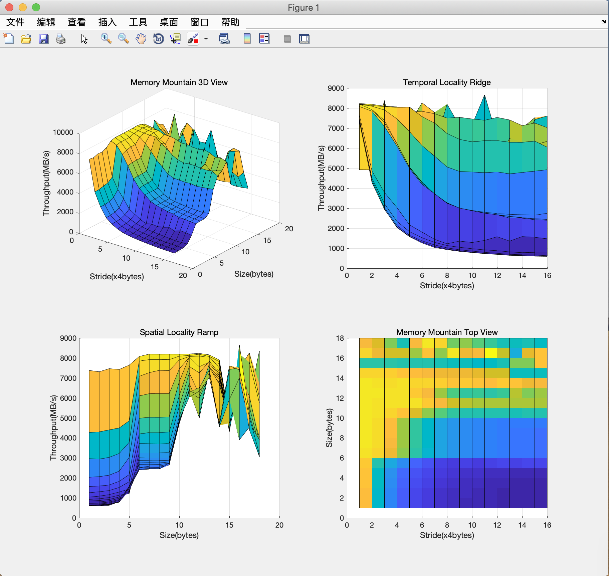

### 存储器山(Memory Mountain)

> **存储器山**是一种综合研究存储器层次结构。也反映了具有不同的时间局部性与空间局部性的程序的性能。通过分析存储器山的数据，还可以看出存储器系统的部分硬件参数。

> 理论上，每台[计算机](https://zh.wikipedia.org/wiki/%E8%AE%A1%E7%AE%97%E6%9C%BA)都有一个唯一的存储器山。通过运行一段测试[程序](https://zh.wikipedia.org/wiki/%E7%A8%8B%E5%BA%8F)，可以得到它的存储器山。了解存储器山，对[应用程序的优化](https://en.wikipedia.org/wiki/Optimization_(computer_science))能起到指导作用。

（摘自维基百科）

### 环境

terminal， gcc，matlab

### 使用

0. 配置matlab：（MacOs，win下可查官网）
    - `sudo vim /etc/profile`  进入环境变量文件，按i编辑
    - `export PATH=/Applications/MATLAB_R2017b.app/bin:$PATH` 写入这段，esc后按`:qw`保存
    - `source /etc/profile` 配置生效
1. 在终端（win下打开命令行），cd到 **MemoryMountain** 目录下，执行 `make`命令,生成 *mountain* 可执行文件
2. 执行 `./mountain` 命令，跑出数据矩阵（显示在终端中）
3. 在目录下新建（`touch data.txt`）*data.txt*文本文件，将**完整数据** 拷贝到该文件中
4. 在终端执行命令 `matlab -nodesktop -nosplash -r "display_mountain data.txt"`,等计算机加载完毕，即在屏幕上出现*matlab*所绘制好的图形窗口

### 生成效果如下

